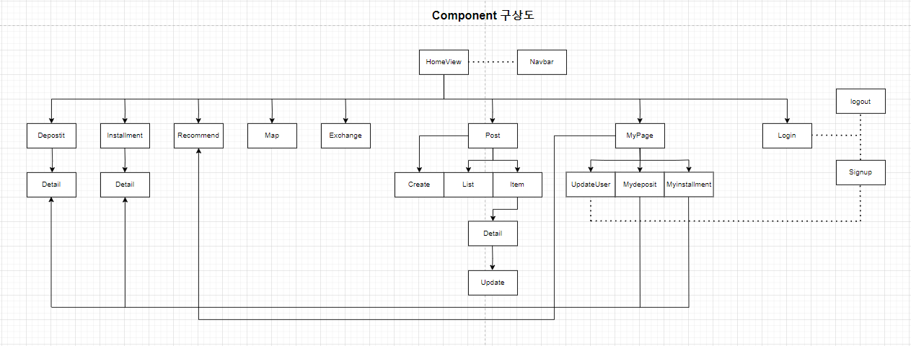
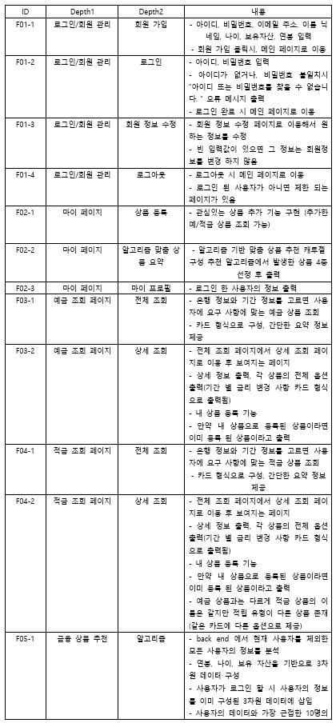
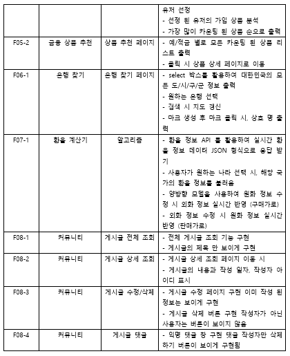
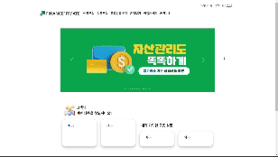
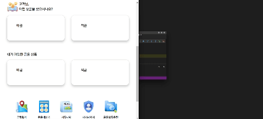

## FINANCEFITMATE 
본 프로젝트는 삼성 청년 SW 아카데미 1학기 관통 프로젝트 결과물입니다.

# 개요
- 다양한 금융 상품의 서비스 제공을 목적으로 제1금융권 은행의 예금, 적금 상품 조회, 가까운 은행 찾기
  커뮤니티, 실시간 환율 정보 서비스, 사용자의 데이터를 기반으로한 알고리즘 추천 서비스 등을 제공합니다.

# 프로젝트 기간
- 2023년 11월 16일 ~ 2023년 11월 24일

# 기술 스택
- API KaKao Map, API 금융감독원, Library vue Vootstrap, Language Python, Language JavaScript
  Database MySql, Framework Vue, Framework Django

# 팀원
- 차준석: 팀장: Back-End 전반, Front 일부
  Back-End (Rest API 설계, SQL/Spring 디버깅, 예금/적금 상품 조회, 사용자 정보 기반 추천 알고리즘,
            DB 테이블 설계, 회원가입/로그인 서비스, 실시간 환율 정보 서비스 제공)
  Front-End (사용자 데이터 기반 chart 제공, 사용자의 요구사항에 맞는 예금/적금 서비스 제공, 
            마이페이지, 상품 등록하기 기능 제공)

- 서민지: 팀원: Front-End 전반, Back-End 일부
   Back-End (커뮤니티 서비스 설계, 카카오맵 api를 이용한 은행 찾기 서비스, 회원정보 수정 서비스 설계)
   Front-End (메인 페이지 구성, 회원가입/로그인 서비스 구성, 모든 vue template 디자인 설계)

# Component 구상도

# 회의록, 계획서
# 1일차 231116
    계획 : 기획, DB 설계

- DB 설계
1. user 정보 저장 db 
    유저이름, 이메일, 가입한 상품 목록 + costom model

2. 금융 상품 데이터(예금, 적금)

3. 환율 정보 계산기
   환율 데이터 json 으로 받아와서 front로 보내기 < 
   환율 데이터 vue 페이지에 출력 select 활용

4. 게시판 페이지
    model 구성 + view 함수 작성

# 2일차 231117
    계획 : pigma 만들기, kakao map 만들기, 추천 알고리즘 제외 backend 구성

- pigma 만들기 -> 주말까지 하기
- kakako map 꼭 성공하기

# 3일차 231120
    계획 : 금융상품 조회 페이지, 상세 페이지, 장바구니
    회원가입페이지 만들기, 로그인, 로그아웃 페이지
    게시글 작성, 수정, 삭제 페이지 만들기
    웹 기획서 마무리하기, 시간되면 추천알고리즘 

# 4일차 231121
    계획 : 백엔드 마무리, 프론트 페이지 구성
    추가 기능 구현 <-

    마이페이지 차트 구현,  추천 알고리즘 만들기
    게시글 작성, 수정, 삭제 페이지 만들기
    커뮤니티 페이지 만들기

# 5일차 231122
    계획 : css 마무리(80%)

    추천 알고리즘 만들기, 백엔드 마무리하기
    css 뼈대 만들기
    

# 6일차 231123
    계획: ppt 만들기, 발표 대본

    css 끝내기, 추가 alert 만들기, 추가 아이디어 있으면 넣기
    ppt 만들기, 발표대본 짜기

# 주요 기능

  
  

# 서비스 화면

    

    

